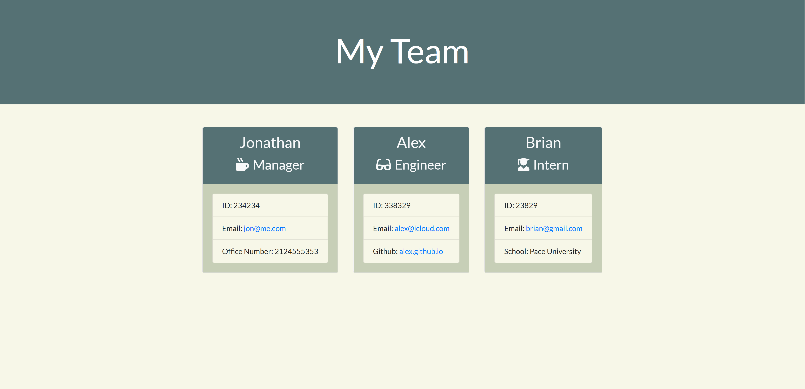

# Team-Profile-Generator

[](https://www.gnu.org/licenses/gpl-3.0)

## Description

A command line tool that allows users to input info about employees and then generates an HTML that displays summaries for each team member.

## Table of Contents

- [Installation](#installation)
- [Usage](#usage)
- [License](#license)
- [Contributing](#contributing)
- [Questions](#questions)

## Installation

Clone the repo and run `npm install` for the required dependencies.

## Usage

Application will be invoked by using the `node app.js` command in the terminal.

## License

This program is free software: you can redistribute it and/or modify
it under the terms of the GNU General Public License as published by
the Free Software Foundation, either version 3 of the License, or
(at your option) any later version.
This program is distributed in the hope that it will be useful,
but WITHOUT ANY WARRANTY; without even the implied warranty of
MERCHANTABILITY or FITNESS FOR A PARTICULAR PURPOSE.See the
GNU General Public License for more details.
You should have received a copy of the GNU General Public License
along with this program. If not, see <https://www.gnu.org/licenses/>

## Contributing

Open source, feel free to modify and share the results!

## Questions

Check out my other repositories in the link below:

- [GitHub Profile](https://github.com/ramandeeppatwar)

- For any additional questions, please [email](mailto:ramandeep.patwar94@gmail.com) me.

## Tests

Run tests with `npm test`. Testing with [Jest](https://jestjs.io/docs/en/getting-started.html).

```
Test Suites: 4 passed, 4 total
Tests:       17 passed, 17 total
Snapshots:   0 total
Time:        1.402 s
Ran all test suites matching /test\\*/i.
```

## Demo

The following image demonstrates the application functionality:

